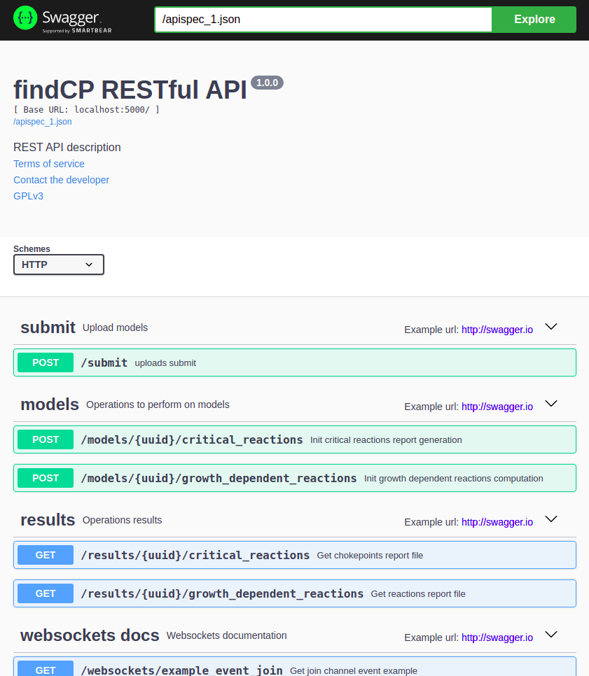
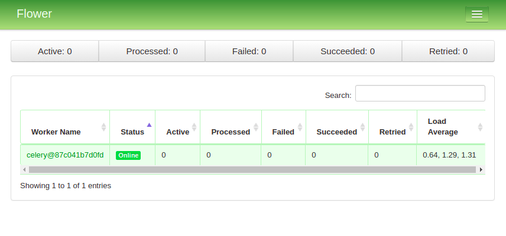

# CONTRABASS RESTful API

[](https://www.gnu.org/licenses/gpl-3.0) 
[](https://github.com/openCONTRABASS/CONTRABASS-webservice/actions/workflows/main.yml)
[](https://sonarcloud.io/summary/new_code?id=openCONTRABASS_CONTRABASS-webservice)
[](https://codecov.io/gh/openCONTRABASS/CONTRABASS-webservice)
[](https://github.com/psf/black) 

```CONTRABASS RESTful API``` is a python-based asynchronous-tasks RESTful API intended for the computation and analysis of vulnerabilities in genome-scale metabolic models. These webservices are just a backed for [CONTRABASS python tool](https://github.com/openCONTRABASS/CONTRABASS). 

## Table of Contents
- [License](#license)
- [Requirements](#requirements)
- [Install dependencies](#install-dependencies)
- [Run](#run)
- [Run with docker-compose](#Run-with-docker-compose)
- [Test](#test)
- [Deployment](#deployment)
  - [Run](#run-1)
  - [Run with supervisor](#run-with-supervisor-(recommended))
- [Deployment with docker](#deployment-with-docker)
- [Maintainers](#maintainers)


## License

CONTRABASS-webservice is released under [GPLv3 license](LICENSE).

## Requirements
- Python>=3.7
- [Redis](https://redis.io/)
- MySQL
- [GLPK](https://www.gnu.org/software/glpk/) (recommended)

## Install dependencies
```
pip install -r requirements.txt
```
or
```
python3 -m pip install -r requirements.txt
```
## Run
1. Change Redis and MySQL params on ```.env```.
2. Run celery worker
    ```
    celery -A src.restapi.celery_app.celery_app worker --loglevel=debug
    ```
3. Run flower
   ```
   celery flower -A src.restapi.celery_app.celery_app -port=5555
   ```
4. Run Flask application
   ```
   python -m src.restapi.app
   ```

See:
- Swagger-UI API interface
  - http://127.0.0.1:5000/apidocs
  

- Flower management page
  - http://localhost:5555
  

## Run with docker-compose

First setup variables on ```.docker.env```.
Assuming you have [Docker](https://docs.docker.com/install/) and [docker-compose](https://docs.docker.com/compose/install/) installed, run on terminal:
```bash
docker-compose up
```

In order to bring it down run:
```bash
docker-compose down
```


## Test

```
pytest -v
```

## Deployment

### Requirements

- Python>=3.7
- [Redis](https://redis.io/)
- MySQL
- [GLPK](https://www.gnu.org/software/glpk/) (recommended)
- [Gunicorn](https://docs.gunicorn.org/en/latest/index.html) (recommended). 
  - See [Deploying Flask applications](https://flask.palletsprojects.com/en/2.0.x/deploying/index.html)
- [Nginx](https://nginx.org/en/) (recommended). 
  - See [Nginx gunicorn config](https://docs.gunicorn.org/en/latest/deploy.html) 
- [Supervisor](http://supervisord.org/) (optional, recommended)

### Run
1. Change Redis and MySQL params on ```.env```.
2. Run celery worker
    ```
    celery -A src.restapi.celery_app.celery_app worker --loglevel=info --concurrency=1 &> logs/celery.out
    ```
3. Run flower
   ```
   celery flower -A src.restapi.celery_app.celery_app -port=5555
   ```
4. Run Gunicorn app with unix socket bind and eventlet workers (See [Flask-socketIO Deploy](https://flask-socketio.readthedocs.io/en/latest/deployment.html#gunicorn-web-server))
   ```
   gunicorn --worker-class eventlet -w 1 --bind unix:/tmp/gunicorn.sock src.restapi.wsgi:app
   ```
5. Setup and run Nginx according to:
   1. [Gunicorn Nginx deployment](https://docs.gunicorn.org/en/latest/deploy.html)
   2. [Flask-SocketIO deployment](https://flask-socketio.readthedocs.io/en/latest/deployment.html#using-nginx-as-a-websocket-reverse-proxy)
   3. [Flask-SocketIO Using nginx as a Websocket Reverse Proxy](https://flask-socketio.readthedocs.io/en/latest/deployment.html#using-nginx-as-a-websocket-reverse-proxy)
   
### Run with supervisor (recommended)
"Supervisor is a client/server system that allows its users to monitor and control a number of processes on UNIX-like operating systems."

"The server piece of supervisor is named supervisord. It is responsible for starting child programs at its own invocation, responding to commands from clients, restarting crashed or exited subprocesseses, logging its subprocess stdout and stderr output, and generating and handling 'events' ". [[Source]](http://supervisord.org/introduction.html#supervisor-components)

To run CONTRABASS-webservice with Supervisor:

1. Change Redis and MySQL params on ```.env```. 
   1. Note: Redis can also be run with Supervisor. 
2. Change the parameters on ```supervisor/dev/*``` config files accordingly.
3. Run celery, flower and Gunicorn with supervisor:
   ```bash
   cd supervisor/dev/
   supervisord -c supervisor.conf
   ```
   ```supervisorctl``` can be executed with:
   ```
   supervisorctl -s unix:///tmp/supervisor.sock
   ```
4. Setup and run Nginx as described previously.

For more info see:
- [Supervisor Configuration file](http://supervisord.org/configuration.html).
- [Celery GitHub page: Supervisor example config file](https://github.com/celery/celery/tree/master/extra/supervisord/).
   

## Deployment with docker

### Requirements
- [Docker](https://docs.docker.com/install/)
- [docker-compose](https://docs.docker.com/compose/install/)

### Run
See section [Run with docker-compose](#run-with-docker-compose)

## Maintainers
[@alexOarga](https://github.com/alexOarga)

